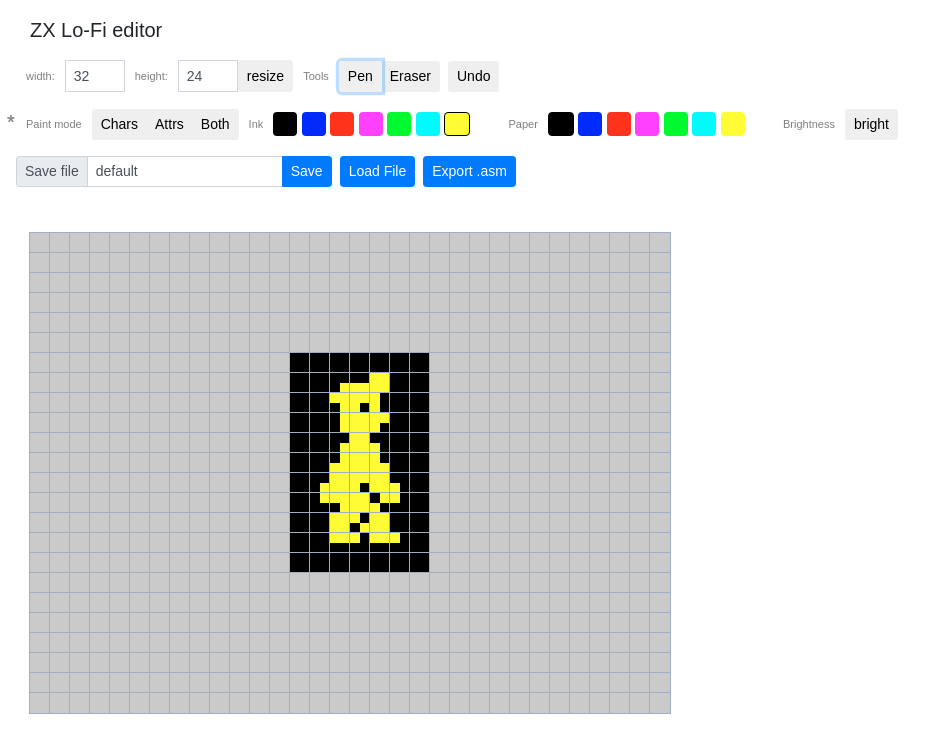

# ZX Spectrum Assembler Playground

## Requirements

Requires:
- assembler eg. [Pasmo assembler](https://pasmo.speccy.org/)
- emulator, eg. :
  - [Zx Spin](https://www.zophar.net/sinclair/zx-spin.html)
  - [ZEsarUX](https://github.com/chernandezba/zesarux)


Compiling with Pasmo.
This assumes you downloaded Pasmo and added it to the path.

Compiling example:
```bash 
 pasmo --name fill_screen --tapbas concepts/screen_layout/fill_screen.asm  taps/fill_screen.tap
```

Repository content: 

## concepts
- ZX Spectrum conceptual examples

## zx_lo_fi_editor
- Javacript based ZX Spectrum "lofi" editor to create images of 64x48 pixels only, and painting them with 32x24 character colors..



## lo_fi
Routines / programs demonstrating lo-fi graphics on ZX Spectrum (64px x 128px)

## hi_fi
Demo of the usage of the graphics routines in full ZX Spectrum resolution (192px x 256px)

## routines
All re-usable routines are located here:

### gfx
Graphic routines:

### math
Mathematical routines (Arithmetic)